# Architecture Audit - LLM-Local

Date: 2026-05-28

Intake classification: maintenance request. Lane: normal.

# Brooks-Lint Review

**Mode:** Architecture Audit\
**Scope:** Entire repository by default, with large ignored model blobs sampled only for cache-boundary impact. No `.brooks-lint.yaml` config found.\
**Health Score:** 74/100\
**Trend:** First run - no trend data.

The architecture is coherent for a local infrastructure repo. The original
audit found runtime configuration knowledge and validation policy spread across
too many surfaces for the next growth phase; Cross-S07 remediated the highest
priority control-plane findings.

## Remediation Status

Implemented by `docs/stories/epics/cross/Cross-S07-runtime-contract-control-plane.md`:

- Runtime facts now live behind `config/runtime-catalog.yaml` and
  `llm_local.catalog`.
- `./llm-local` is now a thin entrypoint over `llm_local.cli`.
- The validation ladder is executable through `config/validation-commands.yaml`,
  `./llm-local validate ...`, and Makefile targets.
- Tracked runtime image defaults are pinned and checked by
  `./llm-local validate images`.

---

## Module Dependency Graph

```mermaid
graph TD
  subgraph ControlPlane["Control plane"]
    CLI["Makefile + llm-local"]
    Preflight["scripts/preflight.py + scripts/smoke.sh"]
    ModelMgmt["models/*.py"]
    RuntimeContracts["Runtime config contracts"]
    ValidationContract["Validation command contract"]
    HarnessDocs["docs/* harness + product truth"]
  end

  subgraph SharedResources["Shared resources"]
    ModelStore["models/ registry + local weights"]
    DatasetStore["datasets/"]
    EvalResults["evaluation/results/"]
    Dashboards["observation/dashboards/"]
    LlmNet["llm-net"]
  end

  subgraph Serving["Serving plane"]
    Ollama["serving/ollama"]
    VLLM["serving/vllm"]
    SGLang["serving/sglang"]
    LlamaCpp["serving/llama.cpp"]
    MLX["serving/mlx"]
    LiteLLM["serving/litellm"]
  end

  subgraph Clients["Client plane"]
    OpenWebUI["clients/open-webui"]
    OCR["clients/ocr-extract"]
  end

  subgraph Workloads["Workload plane"]
    Training["training/unsloth"]
    Evaluation["evaluation"]
    Observation["observation"]
  end

  CLI --> Preflight
  CLI --> ModelMgmt
  CLI --> Ollama
  CLI --> VLLM
  CLI --> SGLang
  CLI --> LlamaCpp
  CLI --> MLX
  CLI --> LiteLLM
  CLI --> OpenWebUI
  CLI --> OCR
  CLI --> Training
  CLI --> Evaluation
  CLI --> Observation

  Preflight --> RuntimeContracts
  Preflight --> ModelStore
  ModelMgmt --> ModelStore
  ModelMgmt --> RuntimeContracts
  ModelMgmt --> LiteLLM
  HarnessDocs --> RuntimeContracts
  HarnessDocs --> ValidationContract

  Ollama --> LlmNet
  VLLM --> LlmNet
  SGLang --> LlmNet
  LlamaCpp --> LlmNet
  LiteLLM --> LlmNet
  OpenWebUI --> LlmNet
  OCR --> LlmNet
  Training --> LlmNet
  Evaluation --> LlmNet
  Observation --> LlmNet

  VLLM --> ModelStore
  SGLang --> ModelStore
  LlamaCpp --> ModelStore
  MLX --> ModelStore
  Training --> ModelStore
  Training --> DatasetStore

  LiteLLM --> Ollama
  LiteLLM --> VLLM
  LiteLLM --> SGLang
  LiteLLM --> LlamaCpp
  LiteLLM --> MLX
  OpenWebUI --> LiteLLM
  OCR --> LiteLLM
  Evaluation --> LiteLLM
  Evaluation --> EvalResults
  Observation --> EvalResults
  Observation --> Dashboards
  Observation --> Ollama
  Observation --> VLLM
  Observation --> SGLang
  Observation --> LlamaCpp
  Observation --> LiteLLM

  classDef critical fill:#ff6b6b,stroke:#c92a2a,color:#fff
  classDef warning fill:#ffd43b,stroke:#e67700
  classDef clean fill:#51cf66,stroke:#2b8a3e,color:#fff

  class CLI,RuntimeContracts,ValidationContract,ModelStore warning
  class Preflight,ModelMgmt,HarnessDocs,DatasetStore,EvalResults,Dashboards,LlmNet,Ollama,VLLM,SGLang,LlamaCpp,MLX,LiteLLM,OpenWebUI,OCR,Training,Evaluation,Observation clean
```

---

## Findings

### 🟡 Warning

**Knowledge Duplication - Runtime Contract Spread**Status: Remediated by
Cross-S07.\
Symptom: Runtime names, host ports, model env keys, gateway aliases, health expectations, and service lists were repeated across `README.md`, `docs/product/domains.md`, `docs/ARCHITECTURE.md`, `llm-local`, `Makefile`, `scripts/preflight.py`, `scripts/smoke.sh`, `models/manage.py`, `models/presets.py`, compose files, and LiteLLM config.\
Source: The Pragmatic Programmer - DRY; A Philosophy of Software Design - Information Leakage; Refactoring - Shotgun Surgery.\
Consequence: Adding or renaming a runtime forces coordinated edits across docs, shell dispatch, Python guardrails, presets, smoke checks, and compose. Drift is already important enough to have `Cross-S04` as a regression story.\
Remedy: Introduce a small runtime catalog, for example `config/runtime-catalog.yaml` or `docs/product/runtime-catalog.yaml`, containing runtime id, compose path, container name, host port env, health endpoint, GPU policy, model env keys, and LiteLLM alias key. Generate or validate preflight, smoke, docs tables, and preset mappings from that catalog.

**Cognitive Overload - CLI Facade Is Becoming The Composition Root**Status:
Remediated by Cross-S07.\
Symptom: `llm-local` was a single Bash dispatcher that contained user help, eval endpoint routing, Docker Compose lifecycle control, model command delegation, status reporting, and smoke invocation. New service commands also had to stay aligned with the Makefile and smoke script.\
Source: Code Complete - High-Quality Routines; A Philosophy of Software Design - Strategic vs. Tactical Programming.\
Consequence: The wrapper is still understandable today, but each new runtime or client increases the chance of inconsistent behavior between `llm-local`, `make`, docs, and validation.\
Remedy: Keep `./llm-local` as the stable user entrypoint, but move command implementation into a small Python CLI package with subcommands and testable command planning. Leave Bash as a shim once service catalog work begins.

**Change Propagation - Validation Ladder Is Not Executable Yet**Status:
Partly remediated by Cross-S07; evidence freshness automation remains open.\
Symptom: `docs/HARNESS.md`, `scripts/README.md`, and `docs/HARNESS_BACKLOG.md` described a future validation ladder, while the executable surface was `make validate`, `make smoke`, `./scripts/smoke.sh --runtime`, and story-specific commands. There was no named release gate or freshness rule for historical story evidence.\
Source: How Google Tests Software - Change Coverage; Working Effectively with Legacy Code - Characterization Tests.\
Consequence: Future agents can prove narrow stories, but they cannot consistently decide what command set is enough for a release-level architecture claim. Evidence can remain marked implemented after runtime images, model assumptions, or host context drift.\
Remedy: Promote the existing harness-backlog items into a story: add a validation command registry, define `validate-quick` and `release-check` targets, and require evidence metadata for host, date, image tag, and command version.

**Dependency Disorder - Floating Runtime Images Weaken Reproducibility**Status:
Remediated by Cross-S07 for tracked defaults.\
Symptom: Compose defaults previously included floating or near-floating image tags such as `ollama/ollama:latest`, `lmsysorg/sglang:${SGLANG_IMAGE_TAG:-latest}`, `ghcr.io/open-webui/open-webui:${OPEN_WEBUI_IMAGE_TAG:-main}`, `prom/prometheus:latest`, `grafana/grafana:latest`, and LiteLLM `main-stable`. Decision `0005` explicitly warns against floating GPU runtime tags.\
Source: Software Engineering at Google - Dependency Management; Hyrum's Law.\
Consequence: A validation result can change without a repo change. GPU runtimes are especially exposed because CUDA/image compatibility and model architecture support can drift underneath the same compose file.\
Remedy: Pin default image tags in `.env.example` or compose, document the upgrade cadence, and require a story-backed proof refresh when a runtime image tag changes.

**Domain Model Distortion - Model Registry Mixes Durable Truth With Local Cache State**Symptom: `models/registry.yaml` and `models/GLM-OCR/model.yaml` are tracked and mark `GLM-OCR` as `status: downloaded`, but model weights are intentionally ignored. In this workspace, `./llm-local model validate` fails because `models/GLM-OCR` has no `.safetensors` file.\
Source: Domain-Driven Design - Bounded Context; A Philosophy of Software Design - Information Leakage.\
Consequence: A fresh clone or cleaned local cache can fail `make smoke` even though Git contains all tracked files. Future agents cannot tell whether `registry.yaml` is durable product truth, local machine inventory, or a generated cache snapshot.\
Remedy: Split tracked desired-model metadata from gitignored local inventory. For example, keep presets and optional model manifests tracked, but generate `models/registry.yaml` from local sidecars as ignored machine state, or teach validation to distinguish `required fixture` from `known downloadable model`.

### 🟢 Suggestion

**Accidental Complexity - Local Model Cache Shares The Repo Namespace**Symptom: The repo keeps model metadata under `models/`, and the same namespace is also used for ignored local model weights when they are present. Generic filesystem scans must remember to filter large model blobs explicitly.\
Source: A Philosophy of Software Design - Information Hiding; Software Engineering at Google - Code Sustainability.\
Consequence: Agent scans, backup tools, shell loops, and ad hoc validation can become slow or noisy even though the Git history stays clean.\
Remedy: Keep registry sidecars in `models/`, but add first-class support for an external model cache path such as `LLM_LOCAL_MODELS_DIR`, with `models/` as a default or symlink target. Update scripts and docs to avoid walking large blob paths unless the command is explicitly model-data aware.

**Testability Seam - OCR Pipeline Has One Remaining Direct Boundary**Symptom: `OcrPipeline` cleanly injects `VisionModelClient`, but it calls `load_document` directly and the FastAPI route constructs `OcrPipeline()` per request. Tests can still monkeypatch this, so the current blast radius is low.\
Source: Working Effectively with Legacy Code - The Seam Model.\
Consequence: If OCR grows to support uploads, storage, auth, or alternate document loaders, route and pipeline tests will need more monkeypatching than necessary.\
Remedy: Defer until OCR changes again, then introduce a small `DocumentLoader` seam and an app-level factory/dependency provider. Do not refactor this preemptively.

---

## Summary

The highest-priority control-plane improvements are now implemented. The next
architectural improvement is to split durable model product truth from local
machine cache state, then add freshness automation for story evidence.

## Validation Run

Cross-S07 remediation proof on 2026-05-28:

- `./llm-local validate quick`: 34 passed, 0 failed.
- `make validate-quick`: 34 passed, 0 failed.
- `make test-integration`: 20 passed, 0 failed.
- `./llm-local validate images`: 1 passed, 0 failed.
- `./llm-local model validate --metadata-only`: passed.
- Runtime/platform checks were not claimed; they require a prepared host with
  services, ports, GPU runtime, and local model files.

## Suggested Future Direction

1. Finish the current next story: validate vLLM runtime proof for `E01-S02`, because LiteLLM, evaluation, observation, and clients all depend on at least one proven OpenAI-compatible backend beyond Ollama.
2. Decide the model-state boundary: either make `models/registry.yaml` local generated state, or add a tracked desired-model manifest that does not claim local weights are present.
3. Add evidence freshness automation for historical story packets and release proof.
4. Define an image upgrade cadence that requires a story-backed proof refresh when runtime tags change.
5. When service count grows again, keep adding runtime facts through the catalog instead of expanding command-specific maps.
